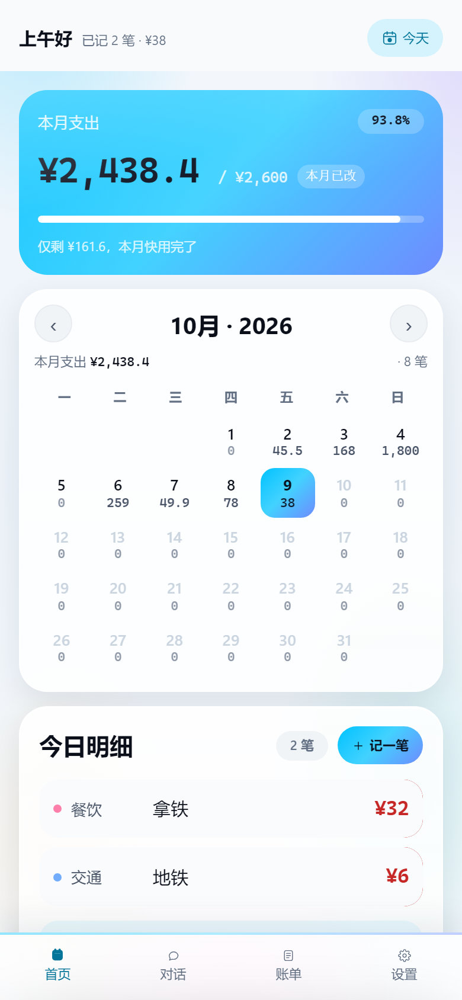
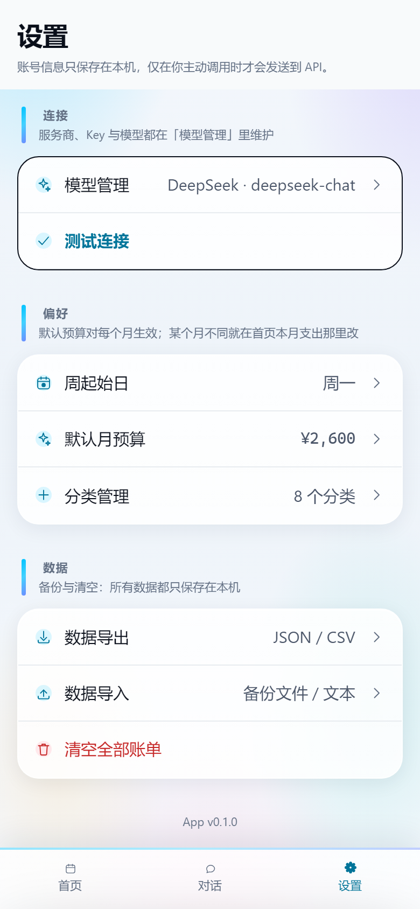
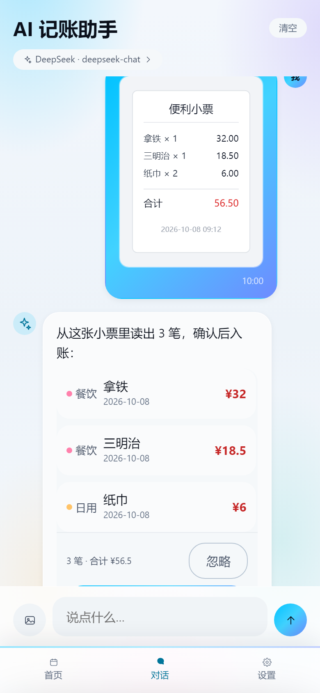
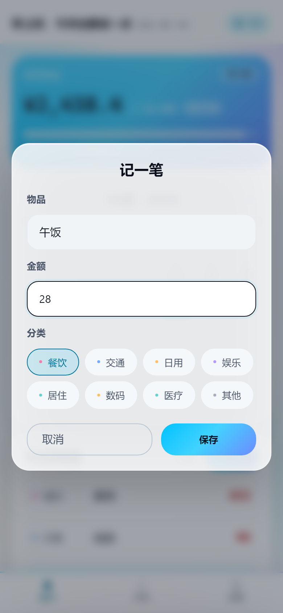
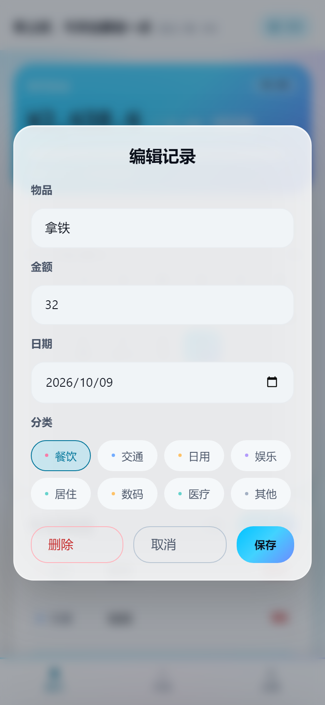
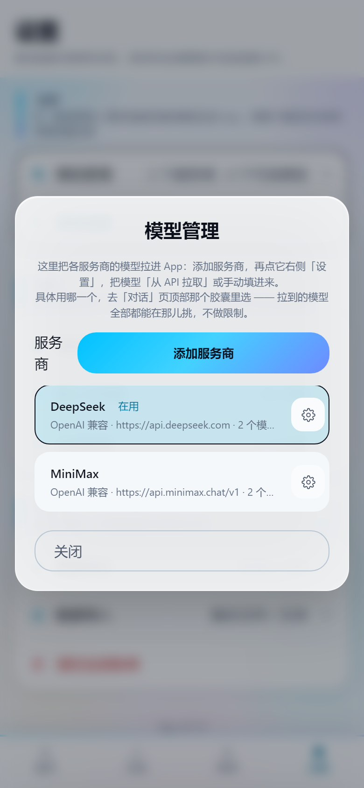
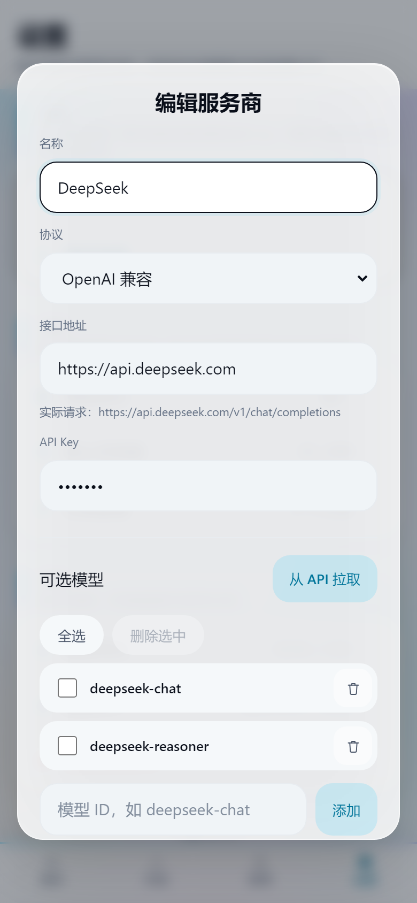

# AI 记账 · jizhang

[](https://github.com/a-zou666/jizhang/actions/workflows/build-android.yml)
[](https://github.com/a-zou666/jizhang/releases)

一句话记账的日历 App：说出「昨天买鼠标 120」，AI 自动拆成「日期 / 分类 / 物品 / 金额」，确认后落进日历。

## 它能听懂什么

| 你说 | 它做 |
| --- | --- |
| 「昨天买鼠标 120，咖啡 18」 | 解析成两笔账，确认后入账 |
| 「把咖啡删了」 | 找到那笔账，确认后删除 |
| 「这个月咖啡花了多少」 | 列出明细 + 本地算好的合计 |
| 「今天天气怎么样」 | 一句话简短答复，不记账 |

每条指令都是**一次独立请求**：不带历史对话，只发一段紧凑提示词 + 最近账目快照，输出一个 JSON —— 最省 token 的做法。

## 特性

- **对话式记账**：独立的「对话」页，像豆包 / 元宝那样聊天；AI 识别后在对话里给出账目卡片，点「确认入账」落账
- **日历记账**：月支出概览与预算进度、每日金额小字、左右滑动或按钮翻月（可看历史）
- **iOS 毛玻璃**：真正的 backdrop-blur 磨砂面板，彩色渐变底衬
- **明细管理**：左滑删除、长按编辑、数据本地存储（不上云）
- **识图记账**：对话页可以直接发小票 / 账单 / 支付截图，视觉模型自己读出每一笔（需支持图片的模型）
- **模型管理**：内置智谱 GLM / 豆包（火山方舟）/ 腾讯混元 / DeepSeek / 通义千问等预设，点一下填好地址并预置模型；地址可填基址也可粘完整 URL，切换启用完全手动
- **数据导出 / 导入**：JSON / CSV 导出，导入时可选「合并」或「覆盖恢复」；备份里的 API Key 一律脱敏，导入不会覆盖本机真实凭据

## 界面截图

下面每张都是 `node scripts/screenshots.mjs` 真实跑 App 截出来的（无头 Chromium，390×844 手机视口），不是设计稿。

| 首页 · 日历记账 | 对话页 · AI 记账 | 设置页 |
| --- | --- | --- |
|  |  |  |

| 对话里的账目卡片 | 识图记账（发小票） | 记一笔 |
| --- | --- | --- |
|  |  |  |

| 编辑 / 删除 | 模型管理 | 服务商的模型列表 |
| --- | --- | --- |
|  |  |  |

## 下载

Android APK 由 GitHub Actions 自动构建并发布到 [Releases](https://github.com/a-zou666/jizhang/releases)，push 到 `main` 即触发。

## 模型管理（App 内设置页）

设置页 → **模型管理**：

1. **添加服务商**：可以直接点预设（智谱 GLM / 豆包 / 混元 / DeepSeek / 通义千问…），也可以手填：名称 + 协议 + 接口地址 + API Key
2. **添加模型**：手动填模型 ID，或「从 API 拉取」后勾选加入
3. **启用**：点列表里的服务商即启用，它的地址 / Key / 默认模型写入当前连接

服务商与模型都只保存在本机，全部由你手动增删改——不会自动建档、也不会自动切换。

### 常用服务商（App 里点一下自动填好）

| 服务商 | 接口地址（补全后） | 常用模型 | 识图 |
| --- | --- | --- | --- |
| 智谱 GLM | `https://open.bigmodel.cn/api/paas/v4/chat/completions` | `glm-4.7-flash`（免费）、`glm-4.7`、`glm-4.6` | `glm-4.6v-flash`（免费）、`glm-4.6v`、`glm-ocr` |
| 豆包（火山方舟） | `https://ark.cn-beijing.volces.com/api/v3/chat/completions` | `doubao-seed-2-1-pro-260915`、Lite、接入点 ID（`ep-` 开头） | `doubao-seed-2-0-mini-260428`、`doubao-seed-vision`、`doubao-ocr` |
| 腾讯混元 TokenHub | `https://tokenhub.tencentcloudmaas.com/v1/chat/completions` | `hy3`、`hy3-preview` | `hy-vision-2.0-instruct`、`hy-vision-1.5-thinking` |
| 腾讯混元（旧入口） | `https://api.hunyuan.cloud.tencent.com/v1/chat/completions` | `hy3`、`hunyuan-turbos`、`hunyuan-lite` | 旧视觉模型已下线 |
| DeepSeek | `https://api.deepseek.com/v1/chat/completions` | `deepseek-chat`、`deepseek-reasoner` | — |
| 通义千问 | `https://dashscope.aliyuncs.com/compatible-mode/v1/chat/completions` | `qwen-plus`、`qwen-turbo` | `qwen-vl-max` |

> ⚠️ 火山方舟的 `https://ark.cn-beijing.volces.com/api/compatible` 是 **Anthropic（Claude）** 协议入口，不是 OpenAI 兼容入口；想走 OpenAI SDK 的请用 `/api/v3`。列表里自动拉到的模型如果名字带 `seedream / seedance / cogview / cogvideo` 是生图/生视频模型，不要选作默认模型，否则 `/chat/completions` 会 404。\n
三家都是 OpenAI 兼容协议，鉴权统一 `Authorization: Bearer <API Key>`。

### 接口地址怎么填

- 填**基址**（`https://api.deepseek.com`、`https://open.bigmodel.cn/api/paas/v4`、`https://ark.cn-beijing.volces.com/api/v3`）或**完整地址**（`…/chat/completions`）都行，完整地址原样使用；
- 已经带版本号（`v1` / `v3` / `v4`）的只补资源名，不会重复插一个 `/v1`；
- 表单下方会实时显示「实际请求：…」，填错一眼就能看出来；
- 各协议默认地址：Claude 原生 `https://api.anthropic.com`、OpenAI 原生 `https://api.openai.com`。

### 识图记账

对话页输入框左边是图片按钮：可以一次选多张小票 / 账单 / 支付截图（最多 9 张），直接发送（也可以补一句话），
视觉模型会自己读出每一笔，回来还是同一张「确认入账 / 忽略」卡片。

- 需要启用一个**支持图片输入**的模型（如 `glm-4.6v-flash`、`doubao-seed-2-0-mini-260428`、`hy-vision-2.0-instruct`）；
- 图片在本机压缩（最长边 1280）后再送模型，聊天记录里只留小缩略图（单条最多 12 张、最近 30 条带图消息保留），原图不入库；
- 清空对话会把这些缩略图一起清掉。

## 开发

```bash
npm install        # 安装依赖
npm run dev        # Vite 开发服务器
npm run check      # 语法 + 单测 + 冒烟测试
npm run preview    # 浏览器预览（无需 Rust，走本地兜底解析）
npm run screenshots  # 真实渲染并截取各页面（需先起 preview，且本地装过 chromium）
npm run tauri dev  # 桌面端调试（需 Rust 工具链）
```

技术栈：原生 HTML/CSS/ES Module + Vite + Tauri 2 (Rust)。数据只存本机 localStorage。
